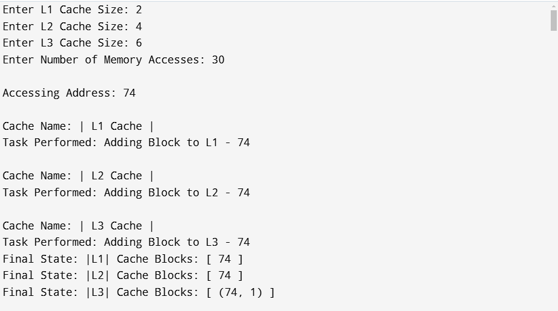
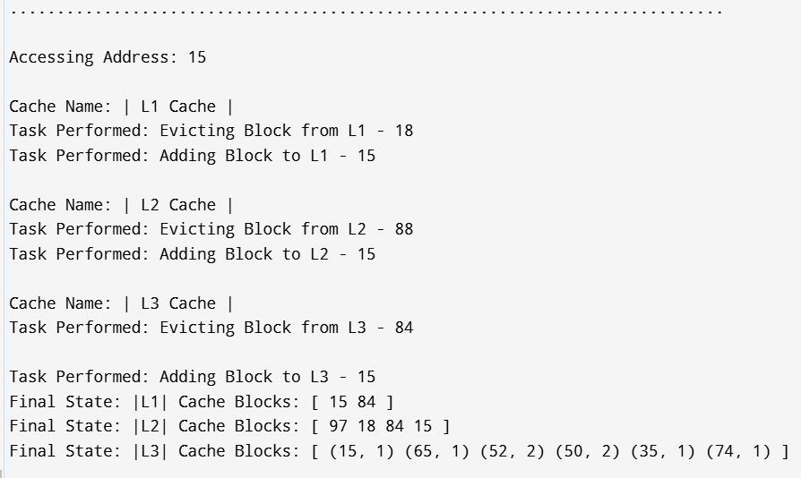
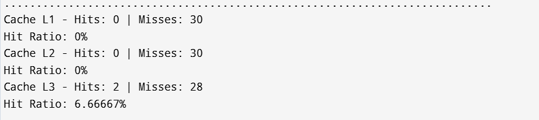

 Multilevel CPU Cache Simulator 🖥️⚡

Overview
This project is a C++ implementation of a Multilevel CPU Cache Simulator, supporting L1, L2, and L3 caches with various cache replacement policies:
✅ LRU (Least Recently Used)
✅ FIFO (First-In-First-Out)
✅ LFU (Least Frequently Used)

It also supports Write-Through and Write-Back policies for memory writes.

Features 🚀

🔹 Multilevel Caching: Simulates a 3-level cache hierarchy (L1, L2, L3). 

🔹 Replacement Policies: Implements LRU, FIFO, and LFU for cache eviction.

🔹 Write Policies: Supports Write-Through and Write-Back caching mechanisms.

🔹 Cache Hit/Miss Statistics: Displays hit/miss count & percentage for performance analysis.

🔹 Dynamic Visualization: Outputs cache state updates in a structured format.

🔹 User Input Support: Allows users to define cache sizes & memory accesses.

Final Output-

Installation & Compilation 🛠️
Using MSVC (Visual Studio Command Prompt)

cl /EHsc /std:c++17 main.cpp /Fe:cache_simulator.exe .\cache_simulator.exe

Using MinGW (g++)

g++ -o cache_simulator.exe main.cpp .\cache_simulator.exe

